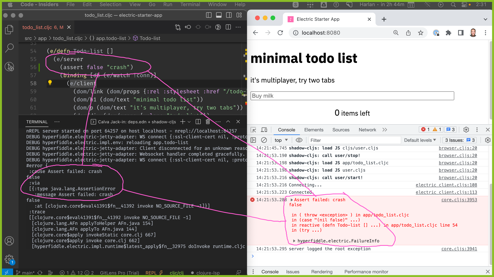

# electric-starter-app

```
$ clj -A:dev -X user/main

Starting Electric compiler and server...
shadow-cljs - server version: 2.20.1 running at http://localhost:9630
shadow-cljs - nREPL server started on port 9001
[:app] Configuring build.
[:app] Compiling ...
[:app] Build completed. (224 files, 0 compiled, 0 warnings, 1.93s)

👉 App server available at http://0.0.0.0:8080
```

# Error reporting

Reproduce this now and confirm error handling works so you trust it:



Electric is a reactive (async) language. Like React.js, we reconstruct synthetic async stack traces. If you aren't seeing them, something is wrong!

# Logging

The Electric server logs. The default logger config is slightly verbose by default to force you to see it working:

```
DEBUG hyperfiddle.electric.impl.env: reloading app.todo-list
DEBUG hyperfiddle.electric-jetty-adapter: Client disconnected for an unknown reason (browser default close code) {:status 1005, :reason nil}
DEBUG hyperfiddle.electric-jetty-adapter: Websocket handler completed gracefully.
DEBUG hyperfiddle.electric-jetty-adapter: WS connect ...
DEBUG hyperfiddle.electric.impl.env: reloading app.todo-list
DEBUG hyperfiddle.electric-jetty-adapter: Client disconnected for an unknown reason (browser default close code) {:status 1005, :reason nil}
```

**Silence the Electric debug logs by live editing logback.xml** and setting `name="hyperfiddle"` to `level="INFO"`, it will hot code reload so no restart is needed. Please **do NOT disable logs entirely**; the Electric server logs one important warning at the `INFO` level we call **unserializable reference transfer**, here is an example:

```
(e/defn TodoCreate []
  (e/client
    (InputSubmit. (e/fn [v]
                    (e/server
                      (d/transact! !conn [{:task/description v
                                           :task/status :active}])
                      nil))))) ;     <-- here
```

Note the intentional `nil` in the final line. If you remove the nil — try it right now — Electric will attempt to serialize whatever `d/transact!` returns — a reference — and stream it to the client. Since that reference cannot be serialized, Electric will send `nil` instead, and log at the `INFO` level:

```
INFO  hyperfiddle.electric.impl.io: Unserializable reference transfer: datascript.lru$cache$reify__35945 datascript.lru$cache$reify__35945@48ea0f24
INFO  hyperfiddle.electric.impl.io: Unserializable reference transfer: datascript.db.Datom #datascript/Datom [1 :task/description "asdf" 536870913 true]
...
```

We decided not to throw an exception here because it is almost always unintentional when this happens. **Do not disable this warning, it will save you one day!** If you want to target this exact message, use this:
`<logger name="hyperfiddle.electric.impl.io" level="DEBUG" additivity="false"><appender-ref ref="STDOUT" /></logger>`

[Note: Perhaps we should revisit this decision in the future now that our exception handling is more mature.]

# Deployment

ClojureScript optimized build, Dockerfile, Uberjar, Github actions CD to fly.io

```
HYPERFIDDLE_ELECTRIC_APP_VERSION=`git describe --tags --long --always --dirty`
clojure -X:build uberjar :jar-name "app.jar" :version '"'$HYPERFIDDLE_ELECTRIC_APP_VERSION'"'
java -DHYPERFIDDLE_ELECTRIC_SERVER_VERSION=$HYPERFIDDLE_ELECTRIC_APP_VERSION -jar app.jar
```

```
docker build --progress=plain --build-arg VERSION="$HYPERFIDDLE_ELECTRIC_APP_VERSION" -t electric-starter-app .
docker run --rm -p 7070:8080 electric-starter-app
```

```
# flyctl launch ... ? create fly app, generate fly.toml, see dashboard
# https://fly.io/apps/electric-starter-app

NO_COLOR=1 flyctl deploy --build-arg VERSION="$HYPERFIDDLE_ELECTRIC_APP_VERSION"
# https://electric-starter-app.fly.dev/
```

- `NO_COLOR=1` disables docker-cli fancy shell GUI, so that we see the full log (not paginated) in case of exception
- `--build-only` tests the build on fly.io without deploying
